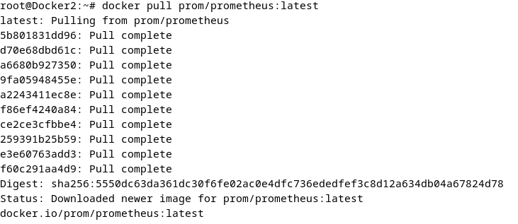

# TP Observabilité des sytèmes

DURCHON Bastien - M2_Infra_Cloud_2025-2026

 

# Module 1 : Prometheus

## **Exercice1 : Installer Prometheus et accéder à l'interface web.**

1. Récupérer l’image :

```bash
docker pull prom/prometheus:latest
```



2. Le lancer :

```bash
docker run -d --name prometheus -p 9090:9090 prom/prometheus:latest
```


3. Ouvrir http://localhost:9090 dans votre navigateur :


4. Aller dans Status > Targets et confirmer que la cible prometheus est UP :


5.  Exécuter docker logs prometheus et lire la ligne de démarrage qui annonce le répertoire de stockage :

d’après ce que jevois dans les logs, le seul endroit de stockage qui nous est donnée est “/etc/prometheus/”


## Exercice 2 : Ecrire votre premier prometheus.yml

1. Arrêter le conteneur précédent :

```bash
docker rm -f prometheus
```

2. créer un fichier prometheus.yml sur l’hôte avec le fichier monté sur “/etc/prometheus/prometheus.yml” avec les paramètres demander :

```yaml
global:
  scrape_interval: 10s
  external_labels:
    environment: 'lab'

scrape_configs:
  - job_name: 'prometheus'
    static_configs:
      - targets: ['localhost:9090']
```

J’ai aussi créer un docker compose dans le même dossier que le prometheus.yml :

```yaml
version: 'latest'
services:
  prometheus:
    image: prom/prometheus
    container_name: prometheus
    ports:
      - "9090:9090"
    volumes:
      - ./prometheus.yml:/etc/prometheus/prometheus.yml
    command:
      - '--config.file=/etc/prometheus/prometheus.yml'
      - '--web.enable-lifecycle'
```

3. J’ai lancer le nouveau conteneur : 

```bash
docker compose up -d
```


4. j’ai modifier le fichier et déclencher un rechargement:

```yaml
global:
  scrape_interval: 20s
  external_labels:
    environment: 'lab'

scrape_configs:
  - job_name: 'prometheus'
    static_configs:
      - targets: ['localhost:9090']
```

donc j’ai set le scrap interval à 20s au lieux de 10s.

j’ai fait la commande :

```bash
curl -X POST http://localhost:9090/-/reload
```

et quand je retourne sur l’interface web on vois ça :


Status → configuration :

```bash
global:
  scrape_interval: 20s
  scrape_timeout: 10s
  evaluation_interval: 1m
  external_labels:
    environment: lab
  metric_name_validation_scheme: utf8
  scrape_native_histograms: false
  extra_scrape_metrics: false
runtime:
  gogc: 75
scrape_configs:
- job_name: prometheus
  honor_timestamps: true
  track_timestamps_staleness: false
  scrape_interval: 20s
  scrape_timeout: 10s
  scrape_protocols:
  - OpenMetricsText1.0.0
  - OpenMetricsText0.0.1
  - PrometheusText1.0.0
  - PrometheusText0.0.4
  scrape_native_histograms: false
  always_scrape_classic_histograms: false
  convert_classic_histograms_to_nhcb: false
  metrics_path: /metrics
  scheme: http
  enable_compression: true
  metric_name_validation_scheme: utf8
  metric_name_escaping_scheme: allow-utf-8
  extra_scrape_metrics: false
  follow_redirects: true
  enable_http2: true
  static_configs:
  - targets:
    - localhost:9090
storage:
  tsdb:
    outofordertimewindow: 0
    retention:
      time: 15d
otlp:
  translation_strategy: UnderscoreEscapingWithSuffixes
  label_name_underscore_sanitization: true
  label_name_preserve_multiple_underscores: true
```

## Exercice 3 : Ajouter node_exporter et scraper les métriques système.

1. Pour le conteneur “Node_exporter” j’ai modifier le docker_compose.yml :

```yaml
version: 'latest'

services:
  prometheus:
    image: prom/prometheus
    container_name: prometheus
    ports:
      - "9090:9090"
    volumes:
      - ./prometheus.yml:/etc/prometheus/prometheus.yml
    command:
      - '--config.file=/etc/prometheus/prometheus.yml'
      - '--web.enable-lifecycle'
    extra_hosts:
      - "host.docker.internal:host-gateway"

  node-exporter:
    image: prom/node-exporter:latest
    container_name: node-exporter
    ports:
      - "9100:9100"
    restart: unless-stopped

```


2. J’ai ajouter un nouveau job pour le node dans prometheus.yml :

```yaml
lobal:
  scrape_interval: 20s
  external_labels:
    environment: 'lab'

scrape_configs:
  - job_name: 'prometheus'
    static_configs:
      - targets: ['localhost:9090']

  - job_name: 'node'
    static_configs:
      - targets: ['node-exporter:9100']
```

3. J’ai déclencher un rechargement avec : 

```bash
curl -X POST http://localhost:9090/-/reload
```


4. j’ai exécuter la requête “node_cpu_seconds_total” et j’ai eu ce résultat :


## Exercice 4 : Découverte de service : par fichier ou Kubernetes.

1. J’ai créer un fichier targets.json et je l’ai compléter avec l’aide de gemini ia pour incérer les deux endpoints :

```json
[
  {
    "targets": ["node-exporter:9100"],
    "labels": {
      "job": "node",
      "host": "serveur-node-exporter"
    }
  },
  {
    "targets": ["prometheus:9090"],
    "labels": {
      "job": "prometheus-internal",
      "host": "serveur-supervision"
    }
  }
]
```

2. je l’ai mis dans un dossier sd : 

```bash
mkdir /ect/prometheus/sd
mv targets.json /ect/prometheus/sd/targets.json
```

3. J’ai modifier le fichier prometheus.yml pour remplacer les static_configs : 

```yaml
global:
  scrape_interval: 10s
  external_labels:
    environment: 'lab'

scrape_configs:
  - job_name: 'dynamic-targets'
    file_sd_configs:
      - files:
          - '/etc/prometheus/sd/*.json'
        refresh_interval: 5s
```

et je modifie le fichier docker-compose.yml pour monter le dossier “/etc/prometheus/sd/”

```yaml
version: 'latest'

services:
  prometheus:
    image: prom/prometheus
    container_name: prometheus
    ports:
      - "9090:9090"
    volumes:
      - ./prometheus.yml:/etc/prometheus/prometheus.yml
      - ./sd:/etc/prometheus/sd
    command:
      - '--config.file=/etc/prometheus/prometheus.yml'
      - '--web.enable-lifecycle'
    extra_hosts:
      - "host.docker.internal:host-gateway"

  node-exporter:
    image: prom/node-exporter:latest
    container_name: node-exporter
    ports:
      - "9100:9100"
```

Quand je relance le docker j’ai ce résultat :


4. Maintenant on vas ajouter ou retirer une cible JSON et voila ce qu’il ce passe :

sans le node-explorer :

```yaml
[
  {
    "targets": ["prometheus:9090"],
    "labels": {
      "job": "prometheus-internal",
      "host": "serveur-supervision"
    }
  }
]
```


je réajoute le node-explorer : 

```yaml
[
  {
    "targets": ["node-exporter:9100"],
    "labels": {
      "job": "node",
      "host": "serveur-node-exporter"
    }
  },
  {
    "targets": ["prometheus:9090"],
    "labels": {
      "job": "prometheus-internal",
      "host": "serveur-supervision"
    }
  }
]

```


## Exercice 5 : Règles d’enregistrement (recording rules).

Pour commencer j’ai télécharger le dossier de l’application et je l’ai mis dans “/etc/prometheus/app”. J’ai modifier le fichier docker-compose.yml pour le lancer :

```yaml
version: 'latest'

services:
  prometheus:
    image: prom/prometheus
    container_name: prometheus
    ports:
      - "9090:9090"
    volumes:
      - ./prometheus.yml:/etc/prometheus/prometheus.yml
      - ./sd:/etc/prometheus/sd
    command:
      - '--config.file=/etc/prometheus/prometheus.yml'
      - '--web.enable-lifecycle'
    extra_hosts:
      - "host.docker.internal:host-gateway"
  demo-api:
    build: ./app/
    container_name: demo-api
    ports:
      - "8000:8000"

  node-exporter:
    image: prom/node-exporter:latest
    container_name: node-exporter
    ports:
      - "9100:9100"
```

En suite j’ai modifier le fichier targets.json :

```yaml
[
  {
    "targets": ["node-exporter:9100"],
    "labels": {
      "job": "node",
      "host": "serveur-node-exporter"
    }
  },
  {
    "targets": ["prometheus:9090"],
    "labels": {
      "job": "prometheus-internal",
      "host": "serveur-supervision"
    }
  },
{
    "targets": ["demo-api:8000"],
    "labels": {
      "job": "demo",
      "host": "demo-api"
    }
  }
]

```

l’application tourne et elle est scrapée à prometheus :


1. Je créer dans le dossier “rules” le fichier “api_rules.yml” avec la règle qui permet de faire une requette http toute les 30 secondes.

```bash
mkdir rules
cd rules
nano api_rules.yml
```

je créer la règle :

```bash
groups:
  - name: api_metrics_rules
    interval: 30s
    rules:
      - record: job:http_requests:rate5m
        expr: sum by (job) (rate(demo_http_requests_total[5m]))

```

2. Je rajoute la rule_file dans “/etc/prometheus/rules/*.yml”

```bash
global:
  scrape_interval: 10s
  evaluation_interval: 15s
  external_labels:
    environment: 'lab'

rule_files:
  - "rules/*.yml"

scrape_configs:
  - job_name: 'dynamic-targets'
    file_sd_configs:
      - files:
          - '/etc/prometheus/sd/*.json'
        refresh_interval: 5s
```

Je modifie le fichier docker-compose.yml pour monter le dossier rules dans mes conteneurs :

```bash
version: 'latest'

services:
  prometheus:
    image: prom/prometheus
    container_name: prometheus
    ports:
      - "9090:9090"
    volumes:
      - ./prometheus.yml:/etc/prometheus/prometheus.yml
      - ./sd:/etc/prometheus/sd
      - ./rules:/etc/prometheus/rules
    command:
      - '--config.file=/etc/prometheus/prometheus.yml'
      - '--web.enable-lifecycle'
    extra_hosts:
      - "host.docker.internal:host-gateway"
  demo-api:
    build: ./app/
    container_name: demo-api
    ports:
      - "8000:8000"

  node-exporter:
    image: prom/node-exporter:latest
    container_name: node-exporter
    ports:
      - "9100:9100"
```

je relance mon docker compose et je recharge prometheus:


On vois que dans les rules sur l’interface web de prometheus il y à ma règle :


Enfin je vais intérroger la nouvelle métrique :

j’ai commencer à envoyer des requettes curl :

```bash
curl http://localhost:8000/api/orders
```

puis sur l’interface web, j’écris sur l’onglet rules :

```bash
job:http_requests:rate5m
```

et je vois ça :


